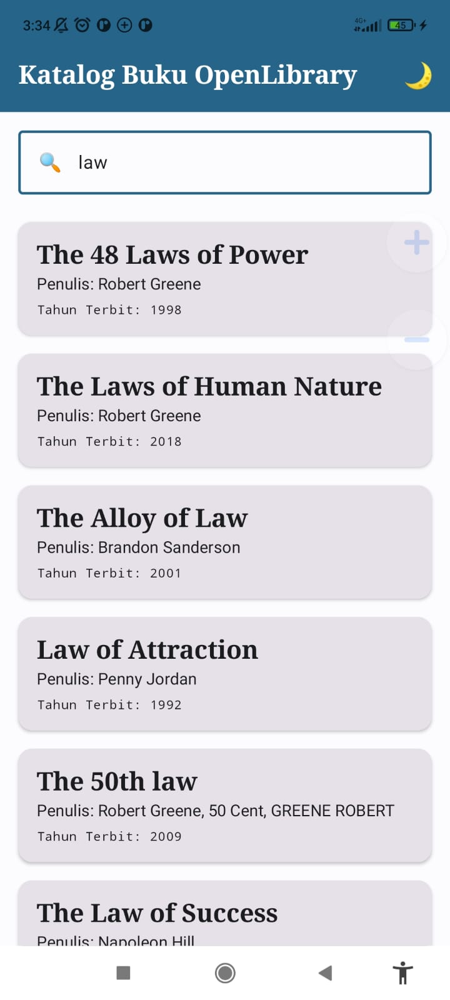
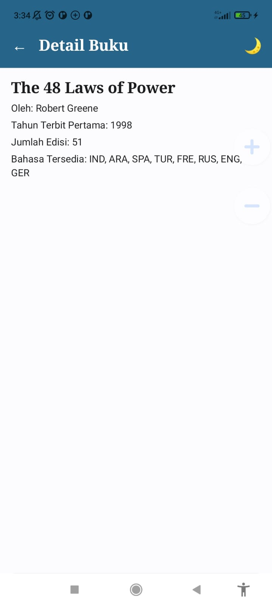

# Katalog Buku OpenLibrary (Responsi Mobile - Paket 2)

Aplikasi Android untuk mencari dan menjelajahi katalog buku dari REST API OpenLibrary, dibuat dengan Kotlin, Jetpack Compose, dan arsitektur MVVM.

## Screenshot

| Home Screen | Detail Screen |
|---|---|
|  |  |

## Fitur
- Pencarian buku berdasarkan kata kunci (parameter `q` pada API).
- Daftar buku dengan `LazyColumn`: judul, penulis, dan tahun terbit pertama (tanpa gambar).
- State-driven UI: loading, error (dengan tombol Coba Lagi), hasil kosong, dan sukses.
- Detail buku: judul, penulis, tahun terbit pertama, jumlah edisi, dan bahasa.
- Navigasi 2 layar (Home dan Detail) dengan tombol back.
- Tema Material Design 3 custom (Light dan Dark) dengan tombol ganti tema di TopAppBar.

## Arsitektur (MVVM)
`View (Composable)` -> `ViewModel (StateFlow<UiState>)` -> `Repository` -> `API Service (Retrofit)`

- **View**: `HomeScreen`, `DetailScreen`, dan komponen reusable (`SearchBar`, `BookItem`, `LoadingView`, `ErrorView`). Composable hanya mengamati state, tidak memanggil API.
- **ViewModel**: `BookViewModel` menyimpan `UiState` (`Idle`, `Loading`, `Success`, `Error`) lewat `MutableStateFlow` privat dan `StateFlow` publik, serta menjalankan request dengan `viewModelScope`.
- **Repository**: `BookRepository` memanggil API dan mengubah response menjadi daftar `Book`.
- **API Service**: `OpenLibraryApi` (Retrofit) dan `ApiClient` (instance Retrofit + converter-gson).
- **Data Model**: `SearchResponse` dan `Book` (semua properti nullable untuk null safety).
- **Detail tanpa API call kedua**: buku yang dipilih disimpan di `selectedBook` pada ViewModel yang dipakai bersama oleh kedua layar (satu instance di `AppNavigation`).

Struktur package:
```
com.pemmob.responsi
├── data/model, data/remote, data/repository
├── navigation
└── ui/components, ui/screens, ui/state, ui/theme, ui/viewmodel
```

## Info API
- Dokumentasi: https://openlibrary.org/dev/docs/api/search
- Base URL: `https://openlibrary.org/`
- Endpoint: `GET /search.json?q={keyword}&limit=20` (tanpa API key)
- Field yang dipakai: `key`, `title`, `author_name`, `first_publish_year`, `edition_count`, `language` (`cover_i` diabaikan)

## Teknologi dan Library
- Kotlin (data class, null safety, lambda)
- Jetpack Compose + Material 3 (Scaffold, TopAppBar, LazyColumn)
- Navigation Compose
- Lifecycle ViewModel Compose
- Retrofit + converter-gson
- Tanpa library gambar

## Cara Menjalankan
1. Clone repository ini, lalu buka di Android Studio.
2. Tunggu Gradle sync selesai.
3. Jalankan ke perangkat atau emulator (minSdk 26, wajib terhubung internet).
4. APK debug tersedia di folder `apk/app-debug.apk`.
